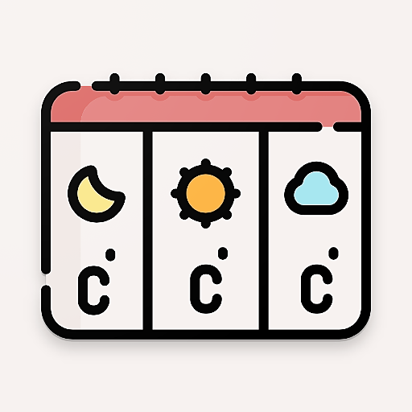
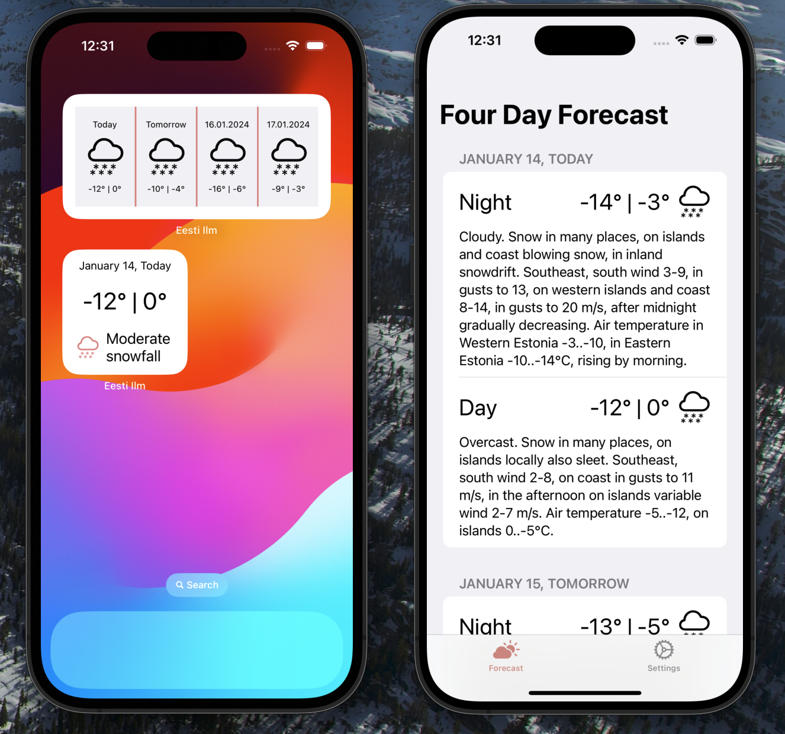

# Eesti Ilm

<h1 align="center">Eesti Ilm – Estonian weather information</h1>

## About the App

Eesti Ilm is a simple weather app, that shows infromation from [Estonian Weather Service](http://www.ilmateenistus.ee/?lang=en)

## Beta Testing
Please use [the link](https://testflight.apple.com/join/xlLG9DS9) to subscribe to app beta testing.

## How to Contribute

### Development

Feel free to file an issue if you have any ideas how the app can be improved. Your PRs are also welcomed.

## Licensing

Copyright © 2024 Andrius Shiaulis.

Licensed under the **MIT License** (the "License"); you may not use this file except in compliance with the License.

Unless required by applicable law or agreed to in writing, software distributed under the License is distributed on an "AS IS" BASIS, WITHOUT WARRANTIES OR CONDITIONS OF ANY KIND, either express or implied. See the [LICENSE](./LICENSE) for the specific language governing permissions and limitations under the License.
